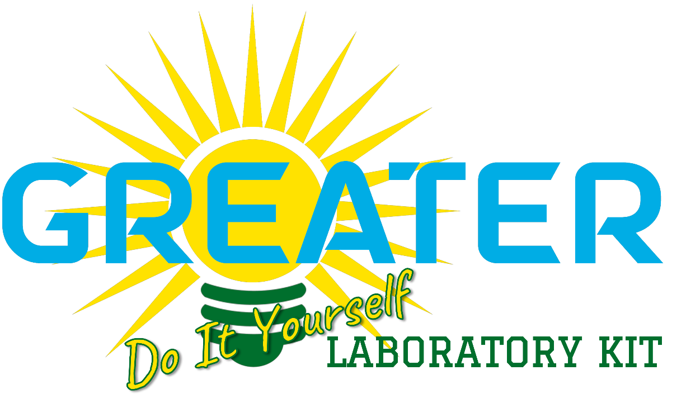

# GREATER - Smart Photovoltaic Household System

This project is part of the GREATER framework and contains the source code for the implementation of the Laboratory Kit Do-It-Yourself. Specifically, this project contains the Smart Photovoltaic Household System documentation with the related firmware, cloud application software and tutorial.

All the documentation an tutorial can be found in the [Wiki page](https://github.com/mircomunch/GREATER-Smart-Photovoltaic-Household/wiki).
## Pages

- [Items](Items.md)
- [Tutorial](Tutorial.md)
- [References](References.md)

## Disclaimer

*The system described in this document is presented as an illustrative
example based on the specific devices, configurations, and custom
software/firmware used in the reference implementation. Its purpose is
to provide a complete, functional model that users may adapt according
to component availability, local requirements, or specific educational
and experimental needs.*

*While hardware choices and system parameters may vary across different
deployments, the core concepts, methodologies, and processes
demonstrated here remain broadly applicable and can serve as a reliable
foundation for further customization, expansion, or integration.*

*This course has been made available as part of the [GREATER
Project](https://www.greaterproject.eu/).*

*The GREATER project has received funding from the European Union’s
ERASMUS+ CBHE (Capacity Building in Higher Education) Programme under
grant agreement 101083081-GREATER — ERASMUS-EDU-2022-CBHE.*
