# Items

[Description](Description.md) | [Tutorial](Tutorial.md) | [References](References.md)

Datasheet references in the **Example** column point to the [Datasheet section](References.md#datasheet).

<table>
<colgroup>
<col style="width: 11%" />
<col style="width: 15%" />
<col style="width: 2%" />
<col style="width: 19%" />
<col style="width: 31%" />
<col style="width: 19%" />
</colgroup>
<thead>
<tr class="header">
<th><strong>Quantity</strong></th>
<th><strong>Name</strong></th>
<th colspan="2"><strong>Specification</strong></th>
<th><strong>Image</strong></th>
<th><strong>Example</strong></th>
</tr>
</thead>
<tbody>
<tr class="odd">
<td>1</td>
<td>Photovoltaic Panel</td>
<td colspan="2">Maximum Voltage and Current ratings according to the
Charge Controller specifications</td>
<td>
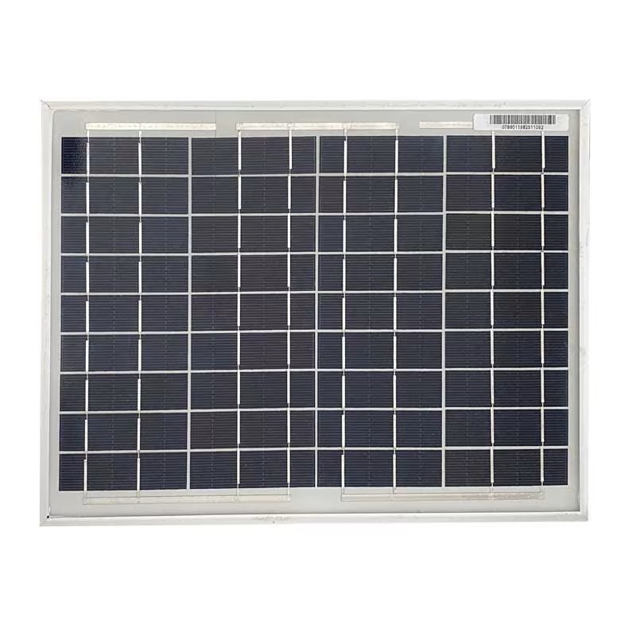

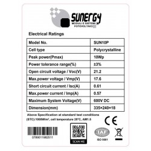
</td>
<td>
10W, Voc 21V, Isc 0.6 A

[1]
</td>
</tr>
<tr class="even">
<td>1</td>
<td>Charge Controller</td>
<td colspan="2">If available with sensors and open digital communication
protocol to detect current and voltage</td>
<td>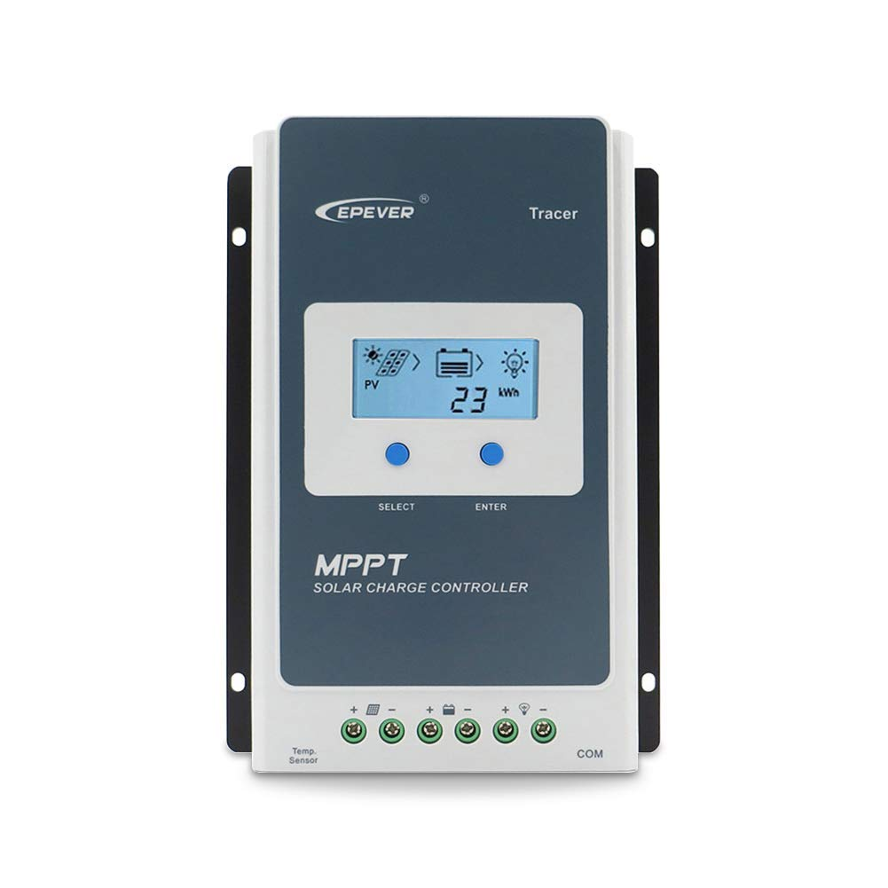</td>
<td>
12V, 10A, with RS485-Modbus communication port

[2]
</td>
</tr>
<tr class="odd">
<td>1</td>
<td>Battery</td>
<td colspan="2">Maximum Voltage and Current ratings according to the
Charge Controller specifications</td>
<td>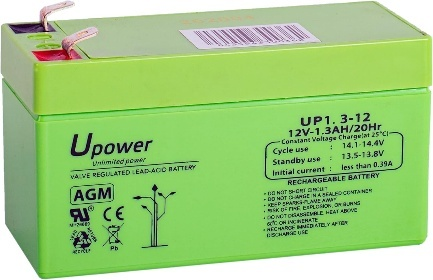</td>
<td>
12V, 1.3Ah

[3]
</td>
</tr>
<tr class="even">
<td><strong>Quantity</strong></td>
<td colspan="2"><strong>Name</strong></td>
<td><strong>Specification</strong></td>
<td><strong>Image</strong></td>
<td><strong>Example</strong></td>
</tr>
<tr class="odd">
<td>1</td>
<td colspan="2">Inverter</td>
<td>Working voltage according to the battery rated voltage</td>
<td>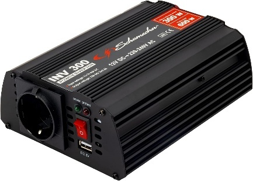</td>
<td>
600W, 12V, Pure sine wave

[4]
</td>
</tr>
<tr class="even">
<td>1</td>
<td colspan="2">Microcontroller</td>
<td>With digital communication pin, WiFi capability</td>
<td>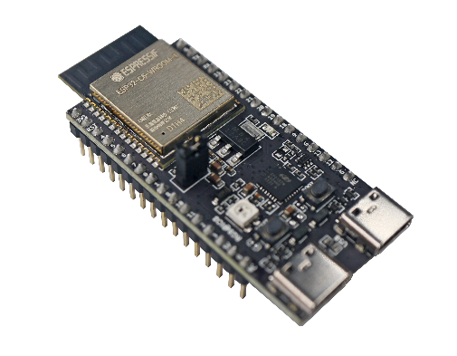</td>
<td>
ESP32 DevkitC V1

[5]
</td>
</tr>
<tr class="odd">
<td>1</td>
<td colspan="2">Temperature and Humidity sensor</td>
<td>Digital sensor</td>
<td>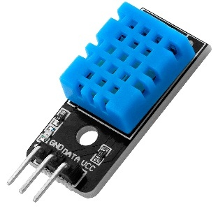</td>
<td>DHT11</td>
</tr>
<tr class="even">
<td>1</td>
<td colspan="2">Max 485 Transceiver</td>
<td>RS485 - TTL converter</td>
<td>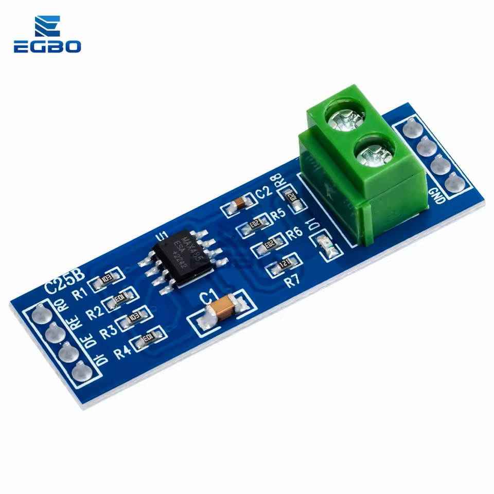</td>
<td>[6]</td>
</tr>
<tr class="odd">
<td>1</td>
<td colspan="2">Relay</td>
<td>AC control of the load with automatic mode to be controlled by a
digital circuit</td>
<td>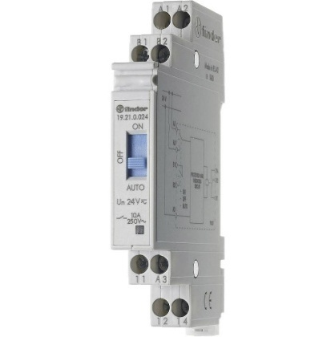</td>
<td>
10A, 230V, Supply 24V (Range 19V – 26V)

[7]
</td>
</tr>
<tr class="even">
<td>1</td>
<td colspan="2">DC supply</td>
<td>Supplying voltage according to the rated supply voltage of the
relay</td>
<td>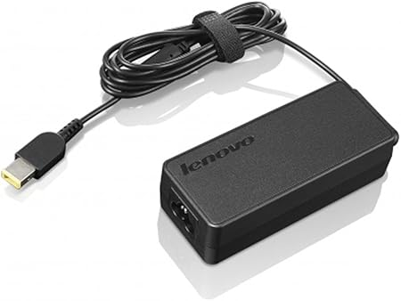</td>
<td>
Output 20V

[8]
</td>
</tr>
</tbody>
</table>

<table>
<colgroup>
<col style="width: 11%" />
<col style="width: 18%" />
<col style="width: 19%" />
<col style="width: 31%" />
<col style="width: 19%" />
</colgroup>
<thead>
<tr class="header">
<th><strong>Quantity</strong></th>
<th><strong>Name</strong></th>
<th><strong>Specification</strong></th>
<th><strong>Image</strong></th>
<th><strong>Example</strong></th>
</tr>
</thead>
<tbody>
<tr class="odd">
<td>1</td>
<td>Power Meter</td>
<td>AC voltage and current sensor with serial communication port</td>
<td>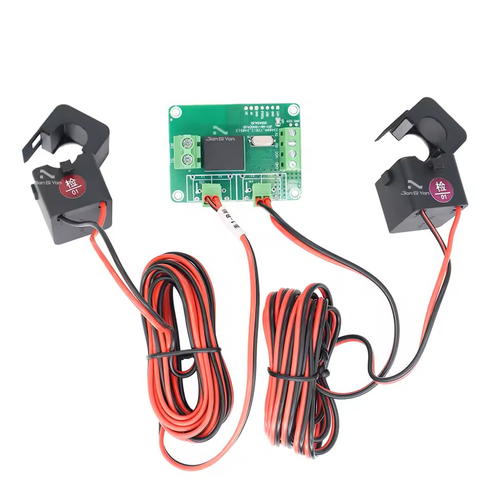</td>
<td>
JSY-MK-194G,

2 channel 100A [9]
</td>
</tr>
<tr class="even">
<td>1</td>
<td>Breadboard</td>
<td>To host all electronics part</td>
<td>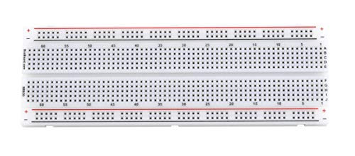</td>
<td></td>
</tr>
<tr class="odd">
<td>1</td>
<td>Switch</td>
<td>(optional) to connect and disconnect the battery easly</td>
<td>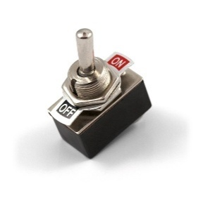</td>
<td></td>
</tr>
<tr class="even">
<td>-</td>
<td>Wires</td>
<td>Based on the other devices specifications</td>
<td>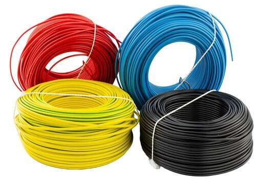</td>
<td></td>
</tr>
<tr class="odd">
<td>-</td>
<td>Cable lugs and terminals</td>
<td>Based on the other devices specifications</td>
<td>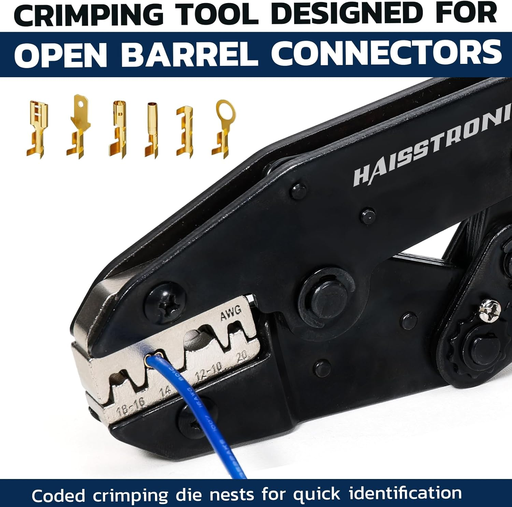</td>
<td></td>
</tr>
<tr class="even">
<td>-</td>
<td>Jumpers and connectors</td>
<td>Based on the other devices specifications</td>
<td>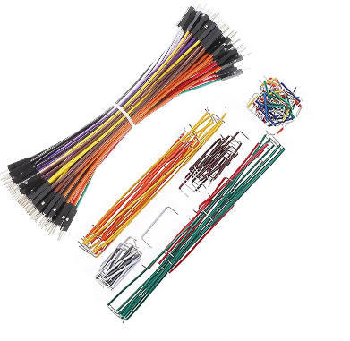</td>
<td></td>
</tr>
<tr class="odd">
<td>-</td>
<td>Banana plug</td>
<td>Based on the other devices specifications</td>
<td>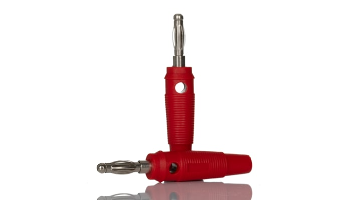</td>
<td></td>
</tr>
<tr class="even">
<td>1</td>
<td>PC or Laptop or Private Server</td>
<td></td>
<td></td>
<td></td>
</tr>
</tbody>
</table>
