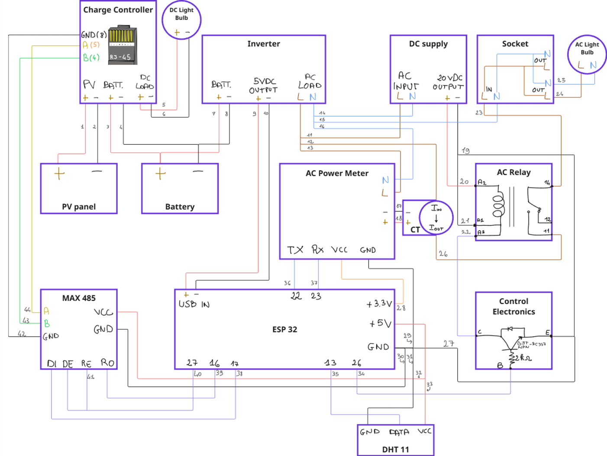

# Tutorial

[Description](Description.md) | [Items](Items.md) | [References](References.md)

The construction of the kit involves three main stages:

1.  **Connecting the power components**

2.  **Connecting the data-communication components**

3.  **Uploading the firmware and launching the cloud application**

Figure – Schematic

## Step Pages

- [Step 1: Power Connections](Tutorial/Step-1-Power-Connections.md)
- [Step 2: Data Transmission Connections](Tutorial/Step-2-Data-Transmission-Connections.md)
- [Step 3: Firmware and Cloud Application](Tutorial/Step-3-Firmware-and-Cloud-Application.md)
