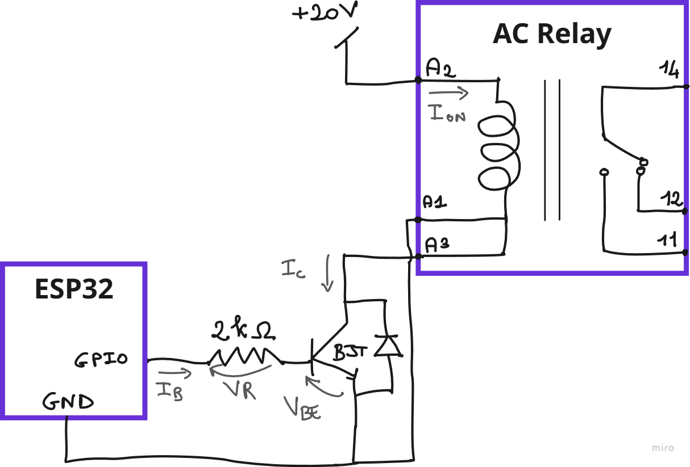

# Step 1: Power Connections

[Description](../Description.md) | [Tutorial](../Tutorial.md) | [Step 2](Step-2-Data-Transmission-Connections.md)

1.  Prepare a suitable frame to mount all devices. If building a
    portable kit, secure all components firmly.

2.  Use the back panel to organize the components and maintain a clean
    layout.

3.  Cut wires to appropriate lengths and attach the correct connectors.
    Use appropriately sized cables according to the expected current.

4.  Build the “Control Electronics” block for driving the relay when its
    coil voltage differs from the microcontroller supply (e.g., 24 V).
    This block uses an NPN transistor operated via a microcontroller
    GPIO, with an antiparallel diode added for protection. See Figure 10
    for further details.

Figure - Pull-down scheme

1.  When GPIO = 0V → VR = VBE = 0V → BJT OFF → IC = Ion = 0A → Relay OFF
    → 14 connected to 12

2.  When GPIO = 3.3V → BJT ON → VBE = 0.75V → VR = 2.55V → IB = VR/R
    (R=2kΩ) = 1.28mA (\< max Current GPIO = 12mA) → IC = Ion = IB\*β
    (β=150) = 191mA (\> min ON current = 16mA) → Relay ON → 14 connected
    to 11

5.  Proceed with connections: from 1 to 27. See Figure 9

    1.  The Current Clamp (CT) must be placed around the live wire that
        goes to the AC load

    2.  Terminals, connectors and cable lug will be used according to
        the connection type

6.  Test system functionality:

    1.  Verify that the PV panel charges the battery

    2.  Check DC load operation

    3.  Test inverter operation

    4.  Confirm that the relay switches the AC load correctly

(Optional) Install a battery-disconnect switch on the negative pole.
