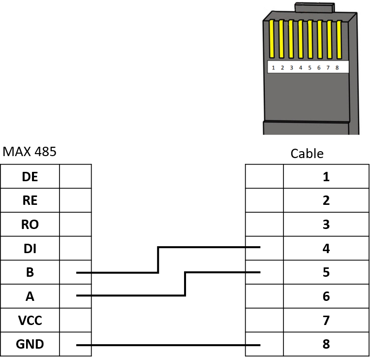

# Step 2: Data Transmission Connections

[Description](../Description.md) | [Tutorial](../Tutorial.md) | [Step 1](Step-1-Power-Connections.md) | [Step 3](Step-3-Firmware-and-Cloud-Application.md)

1.  Mount the microcontroller on a breadboard or PCB.

2.  Prepare an RJ45 cable to connect the MAX485 module to the charge
    controller’s RS485 COM port (pins 4, 5, and 8). See Figure 11

Figure - RJ45 Cable connection

3.  Proceed with all other connections from 28 to 44. See Figure 9

(Optional) Microcontroller pins may be reassigned, but changes must be
reflected in the firmware.
