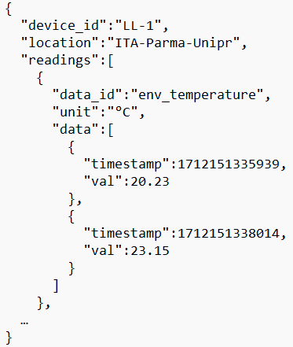
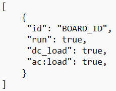
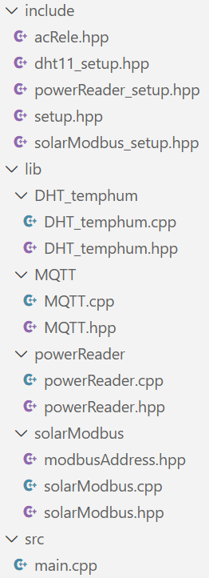
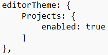
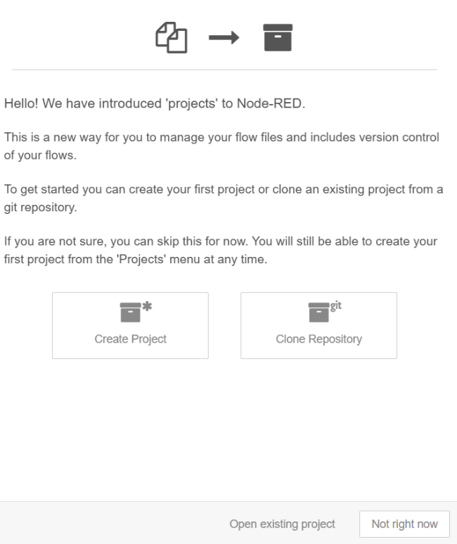
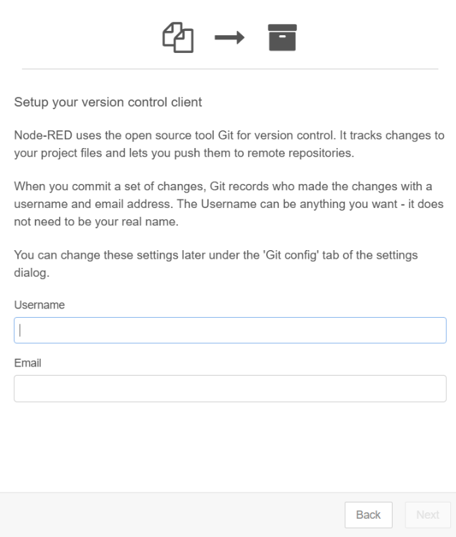
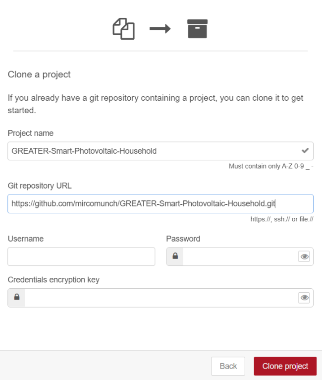
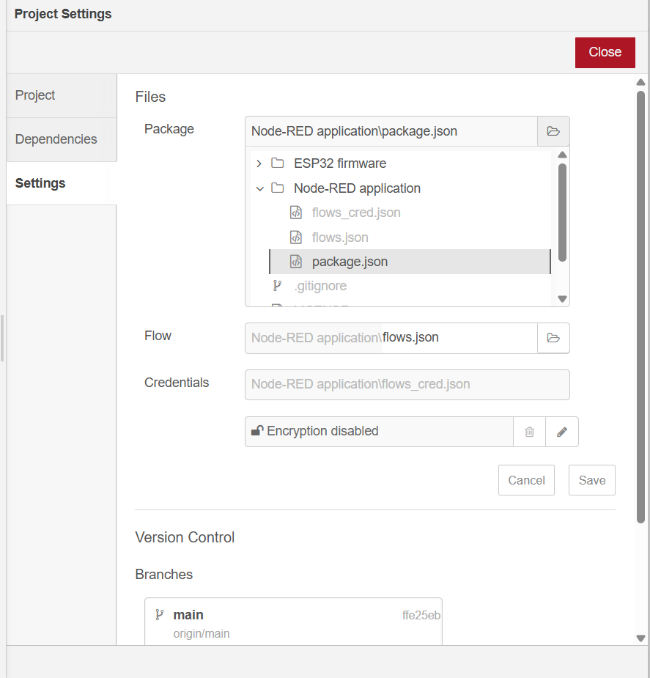
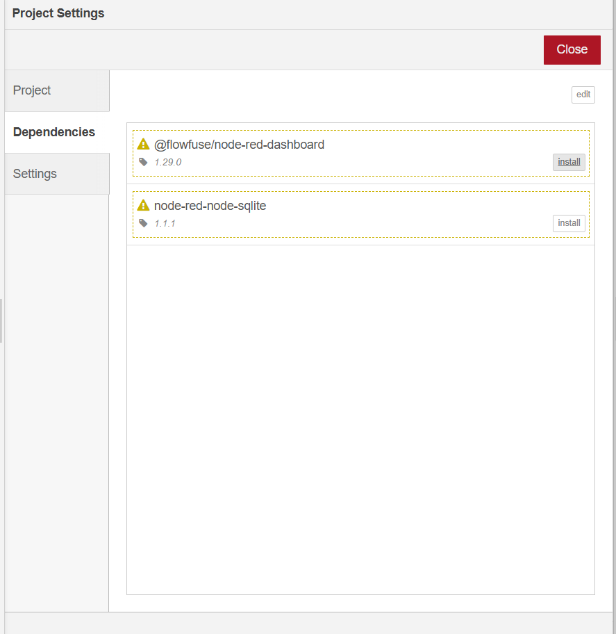

# Step 3: Firmware and Cloud Application

[Description](../Description.md) | [Tutorial](../Tutorial.md) | [Step 2](Step-2-Data-Transmission-Connections.md)

1.  Choose an MQTT Broker provider. This can be a public broker (e.g.,
    test.mosquitto.org, broker.hivemq.com), a free cloud-based service
    such as HiveMQ, or your own MQTT broker if you can make it
    accessible from external networks.

2.  Set up a Wi-Fi network. This will be used by the microcontroller to
    send and receive data. The data are organized in JSON objects with
    identifiers for each type of measurement (Figure 12). This allows
    new data types to be added without modifying the entire
    structure—only new identifiers must be introduced. The currently
    available identifiers are:

    - batt_voltage

    - batt_current

    - batt_soc

    - pv_current

    - pv_voltage

    - load_current

    - load_voltage

    - env_temperature

    - env_humidity

    - inv_voltage

    - inv_current

    - inv_power

Figure - JSON data format

Similarly, commands are also structured as JSON objects, following the
format shown in Figure 13:

Figure - JSON command format

3.  Clone the GitHub directory containing the firmware. You can either
    download the ZIP archive from GitHub (under Code → Download ZIP) or
    install the GitHub CLI tools and execute *git clone
    \<https_github_link\>.*  
    The firmware consists of three sections, as shown in Figure 14:

Figure - Firmware contents

- **lib**: Libraries for the modules used. These files contain custom
  methods based on third-party libraries. This section does not need to
  be modified if you only want to run the default setup. Includes:

  - *powerReader*

  - *solarModbus*

  - *MQTT*

  - *DHT_temphum*

- **include**: Setup files for the modules. Each file contains
  parameters needed to customize the firmware. Here you must insert
  configuration values (such as the MQTT broker, Wi-Fi credentials, or
  specific pins used) to make the hardware operate correctly. Below are
  the major parameters. Those in **bold** within *setup.hpp* must be
  configured. The files also specify data identifiers,
  serial-communication parameters, and the number of retries before a
  reading is considered failed. These are mainly for advanced users.

  - *acRele.hpp*

    - RELE_PIN - Number of the pin used for Relay

  - *dht11_setup.hpp*

    - DHTPIN - Number of the pin used for DHT sensor

  - *powerReader_setup.hpp*

    - JSY_PIN_RX - Receiver pin from JSY sensor

    - JSY_PIN_TX - Transmitter pin from JSY sensor

    - JSY_CLAMP - Clamp number to be read

  - *solarModbus_setup.hpp*

    - PIN_RE_DE - Enable-communication pin for the MAX485

    - PIN_RO - Receive-data pin for the MAX485

    - PIN_DI - Send-data pin for the MAX485

  - *setup.hpp*

    - **BOARD_ID** - Device unique identifier

    - **LOCATION** - Device installation site

    - SENS_TEMPHUM - Enables DHT sensor data reading (if not commented)

    - SENS_POWERINV - Enables inverter power measurement reading (if not
      commented)

    - **WIFI_SSID** - Wi-Fi network name

    - **WIFI_PASSWORD** - Wi-Fi password

    - MQTT_AUTH - Enables authenticated MQTT connection (if not
      commented)

    - **MQTT_HOST** - Broker server name

    - **MQTT_PORT** - Broker port

    - **MQTT_USER** - MQTT username (if authentication enabled)

    - **MQTT_PASSWORD** - MQTT password (if authentication enabled)

    - **MQTT_TOPIC** - Root MQTT topic

    - **MQTT_PUBLISH_TOPIC** - Topic used for publishing data (appended
      to root)

    - **MQTT_DATETIME_TOPIC** - Topic for receiving datetime updates
      (appended to root)

    - **MQTT_CMD_TOPIC** - Topic for receiving commands (appended to
      root)

    - DATA_TIMER - Time interval for data transmission

    - LOAD_TIMER - Time interval for handling commands

- **Scr**: Contains the main file with core functionalities. The system
  is based on two timers: one for reading data from all devices and
  another for handling received commands. Reading functions come from
  the libraries, and this file includes methods to format the data into
  JSON before transmission.

4.  Configure the firmware based on your Wi-Fi and MQTT broker settings
    using the parameters described above.

5.  Download and install Node-RED

6.  Before starting, enable the “Projects” feature in the *settings.js*
    file. This allows you to load the entire application and its
    configuration directly from GitHub. To enable projects, open
    *settings.js* at *C:\Users\\your_user_name\>\\node-red* and modify
    the section shown in Figure 15.

Figure - Enable projects setting

7.  Once Node-RED is installed with the Projects feature, it will prompt
    you at startup to configure the project:

<table>
<colgroup>
<col style="width: 49%" />
<col style="width: 50%" />
</colgroup>
<thead>
<tr class="header">
<th>

Figure - Project startup
</th>
<th>Select “Clone Repository”</th>
</tr>
</thead>
<tbody>
</tbody>
</table>

<table>
<colgroup>
<col style="width: 48%" />
<col style="width: 51%" />
</colgroup>
<thead>
<tr class="header">
<th>

Figure - Project username
</th>
<th>Enter a username and email address. This is only required for Git
operations; <strong>no GitHub account is needed</strong>.</th>
</tr>
</thead>
<tbody>
<tr class="odd">
<td>

Figure - Project GitHub source code link
</td>
<td>
Insert in the “Git repository URL” the Git project url:

https://github.com/mircomunch/GREATER-Smart-Photovoltaic-Household.git
</td>
</tr>
<tr class="even">
<td>

Figure - Package update folder
</td>
<td>In Menù → Projects → Projects Settings → Settings update the
package.json path by selecting the one inside the “Node-RED application”
folder</td>
</tr>
<tr class="odd">
<td>

Figure - Project update dependencies
</td>
<td>In Menù → Projects → Projects Settings → Dependencies install the
required plugins</td>
</tr>
</tbody>
</table>

You may need to remove unused “Configuration Nodes” on the right sidebar
(shown only as numeric blocks), as they can prevent the application from
deploying.

8.  Complete the setup by configuring the environment variables in the
    palette manager: Right Top Menu → Manage Palette → Environment

    - DB_PATH

    - MQTT_HOSTNAME

    - MQTT_PORT

    - MQTT_USR

    - MQTT_PSW

    - MQTT_TOPIC_DATA

    - MQTT_TOPIC_DATETIME

    - MQTT_TOPIC_CMD
